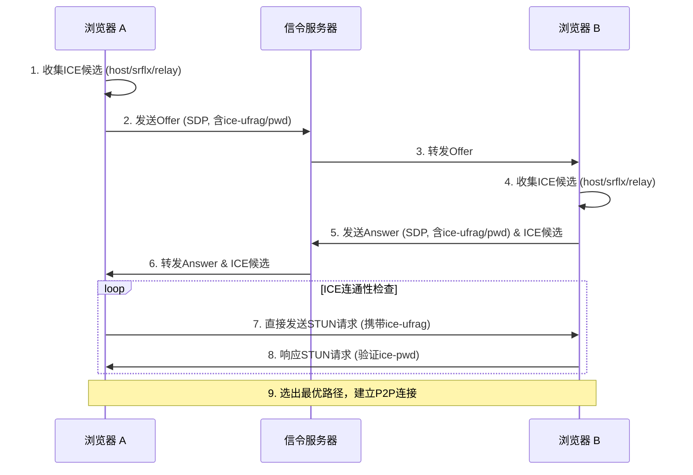

# 0-学习`webrtc`

[内网直传 · 专业修复版(点击体验)](https://cliayn.github.io/WebRTC/)

↑ 使用`deepseek`文本模型构建的，可能存在一些问题，用作学习用应该可以

`WebRTC`与`p2p`连通条件相似，但是因为浏览器处于沙箱环境，没有原生代码能直接固定内网原端口，无视安全风险的能力和相关权限，所以如果除去中继服务器的话，`nat4`的连接会很不稳定

​	**全锥型 vs 对称型**：不需要预测，基本能秒连。

​	**受限型 vs 对称型**：需要预测（或者叫端口试探）。

​	**对称型 vs 对称型**：预测基本没戏，一般只能走 TURN。

# 1-常见NAT等级划分

| 等级      | 官方术语 (中/英)                       | 端对端连通性            | 映射与过滤规则                                               | 典型应用场景                     |
| :-------- | :------------------------------------- | :---------------------- | :----------------------------------------------------------- | :------------------------------- |
| **NAT 1** | 完全锥形 (Full Cone)                   | **极佳** (几乎等同公网) | **映射**：相同内网地址/端口映射为相同公网地址/端口。 **过滤**：无任何限制，任何外部主机可主动连接。 | 公网IP、DMZ主机                  |
| **NAT 2** | 地址受限锥形 (Address-Restricted Cone) | **良好**                | **映射**：与NAT1相同，映射关系固定。 **过滤**：仅允许内网主机**主动通信过**的外部IP地址连接，不限制端口。 | 部分家庭宽带（非普遍）           |
| **NAT 3** | 端口受限锥形 (Port-Restricted Cone)    | **一般**                | **映射**：与NAT1相同，映射关系固定。 **过滤**：仅允许内网主机**主动通信过**的特定外部IP地址**和端口**连接。 | 多数家庭宽带（如电信、联通常见） |
| **NAT 4** | 对称型 (Symmetric)                     | **差** (难以直连)       | **映射**：请求不同目标(IP/端口)时，会动态映射为**不同的**公网端口。 **过滤**：仅允许通信过的目标回包。 | 企业/校园网、手机热点、CGNAT     |

# 2-打洞难点

① 预测端口的变动（端口可预测前提）

② 蜂窝网络获取的是运营商`nat`

③ 直走`ipv6`（无防火墙的前提）

## 注意：

`WebRTC`必须要有信令服务器的理由如下：

1.浏览器的证书指纹（`DTLS`）、安全校验（`ICE-ufrag`）、`STUN/ICE` 的连通性检查

​	① 主要是浏览器的 `ICE` 认证凭证（`ice-ufrag` 和 `ice-pwd`）浏览器不允许动态设置这些值

​	② `DTLS` 指纹（`a=fingerprint`）无法模拟；浏览器为每个 `RTCPeerConnection` 动态生成自签名证书，无法导入或指定证书，因此指纹每次都是新的

2.需要交换`ICE`（候选者池）和`SDP`（会话描述协议）

# 3-问题+原理阐述

## 	问题1-外网

互联网中的环境复杂，按道理来说确实交换`sdp`和`ice`即可，但是因为运营商`nat`,防火墙等因素，所以导致效果并不好

### 外网问题-`nat4`

`nat4`在浏览器中即便是访问同一`ip：port`也会变化出口端口

```
NAT4（对称型NAT）的绑定逻辑是：

	映射端口=Hash(内网IP,内网端口,目标IP,目标端口)
```

​	但是**浏览器每次更换了内网源端口**会导致公网`ip`的出口端口改变,所以**原生代码才是验证理论的最佳工具**

```python
import socket
import time
import struct

# STUN Binding Request 的简单二进制模板
STUN_REQUEST = bytearray([
    0x00, 0x01,           # Binding Request
    0x00, 0x00,           # Length
    0x21, 0x12, 0xA4, 0x42, # Magic Cookie
    # Transaction ID (12 bytes) - 此处固定示例
    0x01, 0x02, 0x03, 0x04, 0x05, 0x06, 0x07, 0x08, 0x09, 0x0A, 0x0B, 0x0C
])

def test_reuse():
    sock = socket.socket(socket.AF_INET, socket.SOCK_DGRAM)
    # 可以绑定固定端口，也可以让系统分配（但一旦分配，整个循环内不变）
    sock.bind(('0.0.0.0', 0))
    local_port = sock.getsockname()[1]
    print(f"本地绑定端口: {local_port}")

    server = ('stun.l.google.com', 19302)

    for i in range(5):
        sock.sendto(STUN_REQUEST, server)
        data, addr = sock.recvfrom(2048)
        # 解析返回的 XOR-MAPPED-ADDRESS
        # 简化处理：直接从响应中提取公网端口（偏移量取决于属性）
        # 此处仅示意，完整解析可参考RFC 5389
        mapped_port = int.from_bytes(data[26:28], 'big') ^ 0x2112
        print(f"第{i+1}次: 公网端口 = {mapped_port}")
        time.sleep(2)

    sock.close()

if __name__ == "__main__":
    test_reuse()
```

#### 结论

​	测不到规律的双`nat4`建议直接走中继服务器

## 问题2-内网

**五元组绑定：** 网络通信依赖 $\{源`IP`, 源端口, 目的`IP`, 目的端口, 协议\}$

但是内网只要获得了`ip:port`即可稳定通信，完全不用中续服务器，当然也存在问题，如下：

### 内网问题-热点`nat`

​	理论来说，我在内网，得到`ip`和`port`随便交换一下`sdp`就可以了,但是！`手机热点`本身相当于开启了一个`nat`，处于其`nat`下面的设备当然随便交换，识别ice候选简直迅捷无比，但是`手机热点设备`本身与电脑则不行，**因为电脑有防火墙，比手机防火墙严格**，以我的举例，手机本身的`ifconfig`如下


​	`rmnet_data`则是蜂窝接口的默认路由，想通过`ipv6`也没办法，同样会遇到**源地址不匹配**

### 难点

①.热点手机不暴露 `192.168.xx.x`，用`ice`探测只能找到运营商给的一般级 `NAT`（`CGNAT`）蜂窝网络内网`IP`（`10.x.x.x`）

#### 原理：

​	浏览器/`App` 的 `WebRTC` 引擎通常绑定的是默认的蜂窝数据网卡（`Cellular Interface`）而非热点网关的虚拟无线网卡

​	当然，手机也能识别`10.x.x.x`，毕竟这个`ip`就是它自己的，问题是电脑防火墙不允许，电脑它发送的目标是`10.x.x.x`，然后回消息的是`192.168.xx.x`，导致**源地址不匹配**

#### 解决方式

①.主动增加局域网候选，例如`192.168.1.1`，进阶就是爆破网关`ip`

②.关闭防火墙/对所有内网`ip`取消防火墙

③.用电脑当热点

# 流程




